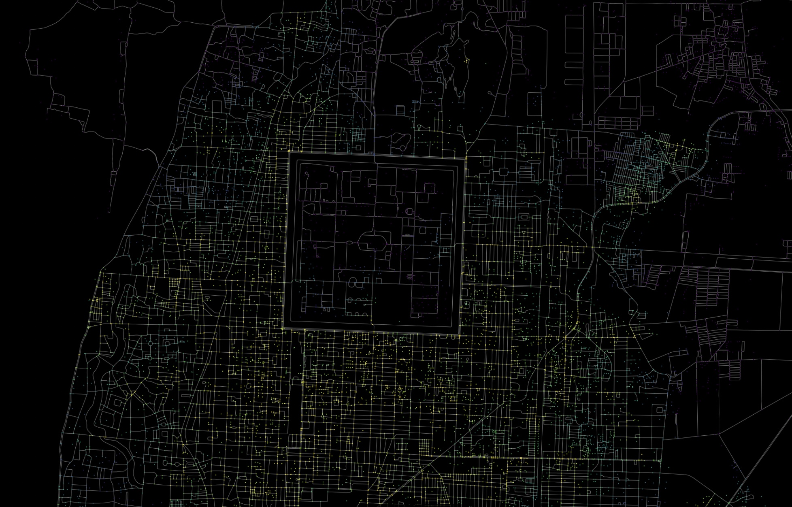

# Routing Analysis with OpenStreetMap &amp; Python

Urban walkability refers to the degree to which an urban area is designed and developed in a way that is conducive to walking. Factors that contribute to walkability include the availability of sidewalks and pedestrian-friendly infrastructure, the proximity of destinations such as shops, restaurants, and public transportation, and the overall safety and attractiveness of the walking environment. Walkable neighborhoods are often considered to be more livable, as they allow residents to easily access the amenities they need and promote a healthy and active lifestyle.

In this project, two network-based methodologies will be employed to examine urban walkability. Initially, we will examine the layout of streets by computing the number of intersections. Subsequently, a more comprehensive analysis will be conducted by performing a city-wide pedestrian routing examination to determine the accessibility of various urban elements. These evaluations are a component of a broader client project that aims to gauge the excellence of urban areas using various metrics and data sets.

## Analysis Outcomes 

